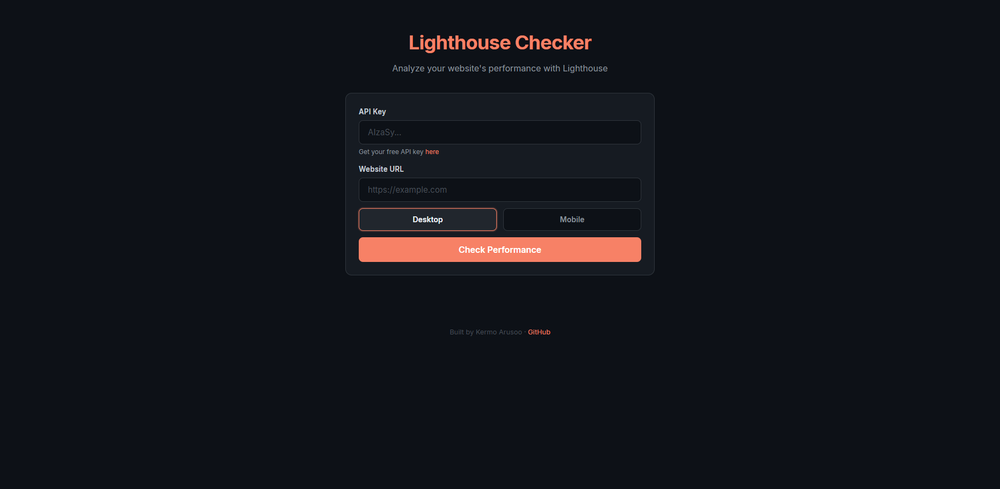

# Lighthouse Checker

A simple web app that analyzes any website's performance using the Google PageSpeed Insights API. Enter a URL and instantly see its Lighthouse scores for Performance, Accessibility, Best Practices, and SEO — with color-coded results following Google's own scoring system.

This is a hobby project built to explore web performance concepts and working with external APIs using vanilla JavaScript.



---

## Features

- **Real-time Lighthouse analysis** — fetches live scores directly from Google's PageSpeed Insights API
- **Mobile & Desktop modes** — toggle between device strategies to compare how a site performs on each
- **Color-coded scores** — green (90–100), orange (50–89), red (0–49), matching Google's Lighthouse thresholds
- **Animated results** — smooth fade-in transitions when scores load
- **Session-stored API key** — your key is remembered for the browser session so you don't have to re-enter it
- **No backend required** — runs entirely in the browser, nothing is stored on any server

---

## How to Use

### 1. Get a Free API Key

The app requires a Google PageSpeed Insights API key. It's free and takes about a minute to set up:

1. Go to the [Google Cloud Console](https://console.cloud.google.com/)
2. Create a new project (or select an existing one)
3. Navigate to **APIs & Services → Library**
4. Search for **PageSpeed Insights API** and enable it
5. Go to **APIs & Services → Credentials**
6. Click **Create Credentials → API Key**
7. Copy the key

For a quicker guide, see [Google's official instructions](https://developers.google.com/speed/docs/insights/v5/get-started#APIKey).

### 2. Use the App

1. Open the [live demo](https://KermoArusoo.github.io/lighthouse-checker)
2. Paste your API key into the first field
3. Enter any website URL (e.g. `google.com` — the app adds `https://` automatically if missing)
4. Select **Desktop** or **Mobile**
5. Click **Check Performance** and wait 10–30 seconds for the results

---

## Built With

- HTML, CSS, JavaScript — no frameworks, no build tools, no dependencies
- [Google PageSpeed Insights API v5](https://developers.google.com/speed/docs/insights/v5/get-started)
- [Inter](https://fonts.google.com/specimen/Inter) font via Google Fonts

---

## Run Locally

No setup needed. Clone the repo and open the HTML file:

```bash
git clone https://github.com/yourusername/lighthouse-checker.git
cd lighthouse-checker
open index.html
```

Or use any local server like VS Code's Live Server extension.

---

## Privacy

Your API key is only sent directly from your browser to Google's API. It is stored in `sessionStorage` (cleared when the tab closes) and is never sent to any other server. The app has no backend.

---

## License

[MIT](LICENSE)
